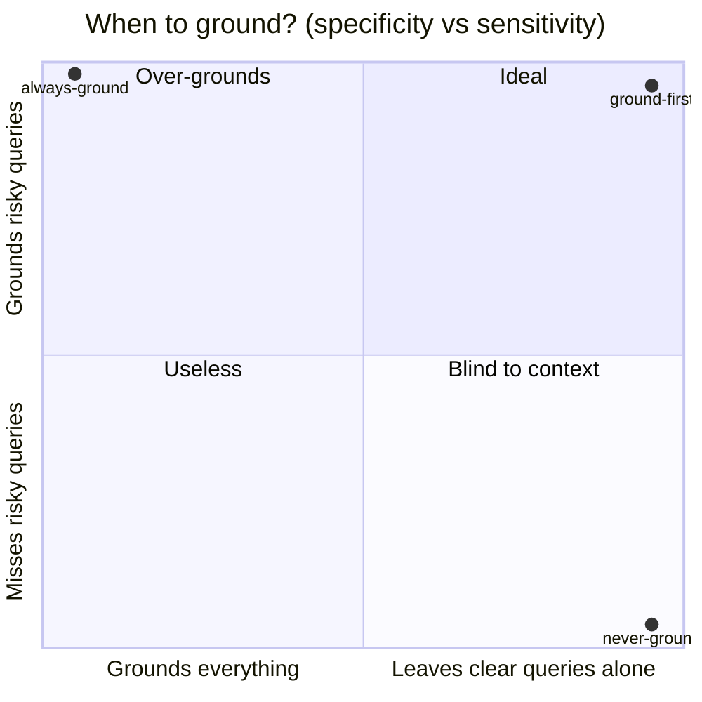

                                                
██████╗ ██████╗  ██████╗ ██╗   ██╗███╗   ██╗██████╗ 
██╔════╝ ██╔══██╗██╔═══██╗██║   ██║████╗  ██║██╔══██╗
██║  ███╗██████╔╝██║   ██║██║   ██║██╔██╗ ██║██║  ██║
██║   ██║██╔══██╗██║   ██║██║   ██║██║╚██╗██║██║  ██║
██████╔╝██║  ██║╚██████╔╝╚██████╔╝██║ ╚████║██████╔╝
╚═════╝ ╚═╝  ╚═╝ ╚═════╝  ╚═════╝ ╚═╝  ╚═══╝╚═════╝ 

  ███████╗██╗██████╗ ███████╗████████╗
  ██╔════╝██║██╔══██╗██╔════╝╚══██╔══╝
  █████╗  ██║██████╔╝███████╗   ██║
  ██╔══╝  ██║██╔══██╗╚════██║   ██║                        
  ██║     ██║██║  ██║███████║   ██║
  ╚═╝     ╚═╝╚═╝  ╚═╝╚══════╝   ╚═╝
                                                

<h3 align="center">Make any AI understand what you're actually talking about — <em>before</em> it answers.</h3>

<p align="center">
  <strong>Claude, GPT, Gemini — they understand almost everything. What they don't have is <em>today</em>.</strong><br/>
  ground-first makes any model detect when your prompt leans on something trending, niche, slang, or brand-new,<br/>
  <strong>search the web</strong>, and show you its read of your prompt <strong>before</strong> it commits to an answer.
</p>

<p align="center">
  Portable skill · works in Claude Code, Codex &amp; any LLM · ~10–150 token overhead · zero dependencies
</p>

<p align="center">
  <a href="LICENSE"></a>
  <a href="https://claude.ai/code"></a>
  <a href="https://openai.com/codex"></a>
  
  <a href="https://github.com/gbbragadev/ground-first/stargazers"></a>
</p>

<p align="center">
  <a href="#where-this-came-from">Origin</a> ·
  <a href="#see-it-in-action">See it</a> ·
  <a href="#how-it-works-30-seconds">How it works</a> ·
  <a href="#get-started-60-seconds">Get started</a> ·
  <a href="#when-to-use-it-and-when-not-to">When to use</a> ·
  <a href="#benchmark">Benchmark</a> ·
  <a href="examples/">Examples</a> ·
  <a href="#contributing">Contributing</a>
</p>

---

> **ground-first** turns *"the AI sounds confident but got me wrong"* into *"the AI checked what I meant first."* It detects context-risk in your prompt, grounds via web search when it matters, and stays out of the way when it doesn't.

## Where this came from

I build things for a living — small products, content, experiments — and most of what I make rides something **current**: a trend that's peaking this week, a tool that dropped yesterday, the way people in one specific niche are talking *right now*.

That's exactly where AI assistants fall down. I'd describe an idea in my own words, leaning on something happening today, and the model would answer with full confidence — for the **generic, year-old** version of what I said. Not wrong-*looking*. Just wrong. And fluent enough that I'd only notice three paragraphs in, after I'd already started building on it.

The failure was never *"the model is dumb."* These models understand almost everything. The failure is that **they don't know what they don't know about right now** — so they fill the gap with the most statistically common meaning instead of *mine*, and present it as fact.

`ground-first` is the guardrail I wanted: before the model answers, it stops and asks itself *"wait — is this prompt leaning on something I might be out of date on?"* If yes, it searches, and shows me its interpretation in one short block I can correct in five words. If no, it gets out of the way completely.

> **It's not just me.** Mid-benchmark, the very model *building this skill* did exactly this — live, about real AI models past its training cutoff. See [**Exhibit A: caught in the wild**](examples/caught-in-the-wild.md). You can't stage a better proof that this failure mode is universal and invisible from the inside.

**Who it's for — not just developers:**

- **Creators** riding a trend who need the model to *get the niche*, not hand back generic advice
- **Indie builders** describing an app idea in their own words, tired of the model assuming a different product
- **Solopreneurs** asking about *their* community, market, or culture — not a generic global audience
- **Developers** burned by the model assuming the wrong framework version or stack

The common thread: **the AI answered confidently to a question you didn't ask.**

## See it in action

Same prompt, leaning on a trend the model half-remembers:

**Without ground-first** — confident, fluent, *wrong*:

```
You:  help me ride the "demure" trend for my brand

AI:   Sure! To come across as more demure and modest in your
      branding, use muted tones, soft fonts, and humble,
      understated language...                ← the dictionary meaning
```

**With ground-first** — it checks first, then nails it:

```
You:  help me ride the "demure" trend for my brand

AI:   ┌─ GROUNDING ───────────────────────────────────┐
      │ What I think you mean:                         │
      │ the "very demure, very mindful" TikTok trend   │
      │ (Jools Lebron, Aug 2024) — ironic, exaggerated │
      │ "office-appropriate" humor, not literal modesty│
      │ Context: web search (Reddit + news) · HIGH     │
      │ Wrong? Tell me before I continue.              │
      └────────────────────────────────────────────────┘
      Here's how to ride it without looking three weeks late...
```

You can correct a wrong interpretation in five words. You can't un-read a 500-word answer built on the wrong premise.

## What it does

- **Detects context-risk** in your prompt — trends, slang, viral content, niche refs, fresh releases, anything time-sensitive
- **Grounds via web search** when (and only when) the context demands it
- **Shows its interpretation first** in a short, correctable block — before spending tokens on the full answer
- **Stays silent on clear queries** — CSS, math, plain technical questions get answered directly, with zero overhead
- **Runs anywhere** — one portable `SKILL.md` for Claude Code & Codex, one paste-able line for every other LLM

## How it works (30 seconds)

```
your prompt  →  DETECT  →  GROUND  →  ANSWER
                (risk?)    (search +   (verified
                           show block)  context)
```

A mandatory 3-phase protocol before any response:

| Phase | What happens |
|-------|--------------|
| **1 · DETECT** | Scan the prompt for context-risk signals (trends, slang, viral content, niche refs, recent events) |
| **2 · GROUND** | If risk is present: search the web, then show an explicit interpretation block |
| **3 · ANSWER** | Respond with verified context — or, if nothing risky was found, just answer |

The whole point is **Phase 2's block**: a five-line "here's what I think you mean" you can reject before the model builds on it.

## Get started (60 seconds)

**Just want to try it?** Paste this at the start of any chat — works in ChatGPT, Gemini, Claude, anywhere:

```
Before answering, tell me what you think I'm talking about. If it involves
trends, slang, platform culture, or anything time-sensitive, search the web
first. Show me your interpretation before giving the full answer.
```

**Claude Code:**

```bash
git clone https://github.com/gbbragadev/ground-first.git
cp -r ground-first ~/.claude/skills/      # or: ln -s for live updates
```
Then invoke `/ground` (or `/ground lite`) in any session.

**OpenAI Codex:**

```bash
cp -r ground-first ~/.codex/skills/
```
Then invoke `$ground`.

### Modes

| Mode | Triggers on | Output | Token overhead |
|------|-------------|--------|----------------|
| `lite` | HIGH risk only | one inline sentence | ~10–20 |
| `full` *(default)* | MEDIUM + HIGH | full grounding block | ~50–150 |

```
/ground            → activate (full mode)
/ground lite       → lightweight, one-line assumption only
stop grounding     → deactivate
```

## When to use it (and when not to)

**Great fit if you…**
- build on **trends, current events, or tools that dropped recently**
- work across **cultures, markets, niches, or communities** with their own language
- keep getting burned by the model assuming the **wrong framework version** or tech stack
- want a **cheap check** before the model commits to a reading of an ambiguous request

**Skip it (or just run `lite`) if you…**
- ask mostly **clear, timeless, technical** questions — it'll correctly stay silent anyway, you just won't see it work
- always want the **single fastest** possible answer and never reference anything time-sensitive

It's designed so the cost of being wrong about *when* to ground is low: on clear queries it does nothing.

## What triggers grounding

| Signal type | Examples |
|-------------|----------|
| Platform-specific trends | "that TikTok sound", "the Instagram filter everyone uses" |
| Viral / trending content | "the meme where X", "that video everyone shared" |
| Slang / colloquial | Gen-Z terms, regional language, abbreviations |
| Named cultural phenomena | "brat summer", "quiet quitting", "brain rot", "demure" |
| Niche communities | game meta, fandom references, hobby jargon |
| Recent events / releases | anything that may be after the training cutoff |
| "Everyone knows" framing | "you know that thing where…" |
| Implicit pop-culture refs | anywhere a plausible-but-wrong interpretation exists |

## Other ways people use it

It started as a *cultural/trend* guardrail, but the same "check before you commit" reflex pays off well beyond that:

- **Dev & versioning** — "the new Angular routing", "the latest app router" → don't answer for the API from two versions ago
- **Fresh releases** — a model, library, or product launched after the cutoff (the exact trap in [Exhibit A](examples/caught-in-the-wild.md))
- **Niche jargon** — game meta, fandom shorthand, industry/hobby slang that means something specific
- **Regional & market context** — something specific to *your* country, market, or community, not the generic global default
- **Your own project's language** — terms that mean one thing *in your world* and another everywhere else
- **Ambiguous intent** — when a plausible-but-wrong reading exists ("delete the user" → soft-delete or hard-delete?)

## Benchmark

Full results — including the warts — in [**BENCHMARK.md**](BENCHMARK.md). It's a directional pilot, reported honestly (a benchmark that only flatters the tool is marketing, and the first skeptic breaks it).

**Headline (reproducible, no confound):** across 3 runs the skill correctly grounded **21/21** in-scope risky queries and correctly left **6/6** control queries (CSS, math) alone — **100% specificity, zero false-positive overhead.** It knows when to act *and* when to stay out of the way.

**Honest caveat:** when both the skill and a plain search-enabled baseline can search, ground-first does **not** reliably produce better *facts*. What it buys is **calibrated honesty** (it's never confidently wrong) and **correctability** (you catch a bad read before the full answer) — not raw answer quality. The benchmark says so plainly.



## Token economy

The question isn't *"how many tokens does grounding cost?"* — it's *"how many tokens does a wrong answer cost?"*

| Scenario | Tokens |
|----------|--------|
| Wrong response + correction + rewrite | 600–1,600 |
| `ground-first` overhead (lite mode) | 10–20 |

**It pays for itself after a single avoided misinterpretation.**

## Repo contents

| File | Purpose |
|------|---------|
| `SKILL.md` | The skill — Claude Code, Codex, Gemini CLI, any LLM |
| `BENCHMARK.md` | Full benchmark, methodology, and charts |
| `evals/` | Test cases + how to add your own (no coding needed) |
| `examples/` | Real eval results, including Exhibit A |

## Prior art & inspiration

Built on top of existing work — hat tip to:

- **[grill-me](https://github.com/mattpocock/skills)** by Matt Pocock — forces understanding before *implementation* (planning focus)
- **Anthropic's "ground-first prompting"** — official technique for long-context document grounding
- **Web-search tool patterns** — search-before-answering for knowledge-cutoff issues

The gap `ground-first` fills: an automatic, portable skill that *detects* culturally-specific / trending / time-sensitive references and *triggers web-search grounding* before responding. No existing skill does this generically.

## Contributing

PRs welcome — especially:
- new context-risk signal patterns
- platform-specific adaptations
- non-English slang detection
- eval results from your own tests (see [`evals/CONTRIBUTING.md`](evals/CONTRIBUTING.md))

## License

MIT — use it, remix it, ship it.

---

<p align="center"><sub>Built with the <a href="https://docs.anthropic.com/en/docs/claude-code">Claude Code Skills system</a> · compatible with any LLM · <a href="https://github.com/gbbragadev/ground-first">★ star it</a> if it saved you a wrong answer</sub></p>
